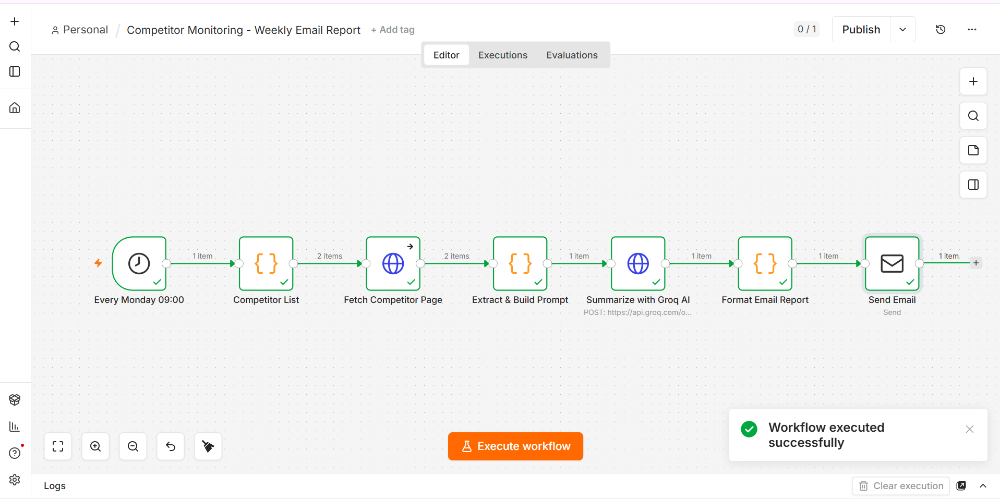

# Competitor Monitoring - Weekly Email Report

An n8n workflow that automatically scans a list of competitor websites every week, summarizes notable changes and positioning using AI, and emails a concise report.

## What it does

1. **Trigger** – Runs automatically every Monday at 09:00.
2. **Competitor List** – Holds the list of competitors to track (name + URL).
3. **Fetch Competitor Page** – Downloads the raw HTML of each competitor's website.
4. **Extract & Build Prompt** – Parses the page title, headings, and visible text from the HTML, then builds a single analysis prompt covering all competitors.
5. **Summarize with Groq AI** – Sends the prompt to Groq's OpenAI-compatible Chat Completions API (`openai/gpt-oss-120b`) and gets back a Markdown competitive-intelligence report.
6. **Format Email Report** – Wraps the AI's report into an email subject and body.
7. **Send Email** – Delivers the report via SMTP (configured for Brevo/Sendinblue).

## Requirements

- A self-hosted n8n instance (tested on n8n 2.28.5, Docker).
- A [Groq](https://console.groq.com) API key (free tier available).
- An SMTP provider for sending email (e.g. [Brevo](https://www.brevo.com)) with a verified sender address.

## Setup

1. **Import** `weekly-competitor-report.json` into n8n (Workflows → Import from File).
2. **Add a Header Auth credential** for Groq:
   - Name: `Authorization`
   - Value: `Bearer <your-groq-api-key>`
   - Attach it to the **Summarize with Groq AI** node.
3. **Add an SMTP credential** for your email provider and attach it to the **Send Email** node.
4. Open the **Send Email** node and set the `From Email` / `To Email` fields to your own addresses.
5. Open the **Competitor List** node and replace the example entries (BMW, Mercedes-Benz) with the competitors you want to track.
6. Activate the workflow, or run it manually with **Execute workflow** to test.

## Notes

- The scraper does simple HTML parsing (title, `<h1>`–`<h3>` headings, and stripped body text) — no headless browser is used, so JavaScript-rendered pages may return limited content.
- The AI model used (`openai/gpt-oss-120b` via Groq) can be swapped for any other Groq-hosted or OpenAI-compatible chat model by editing the `model` field in the **Summarize with Groq AI** node.

## License

MIT

